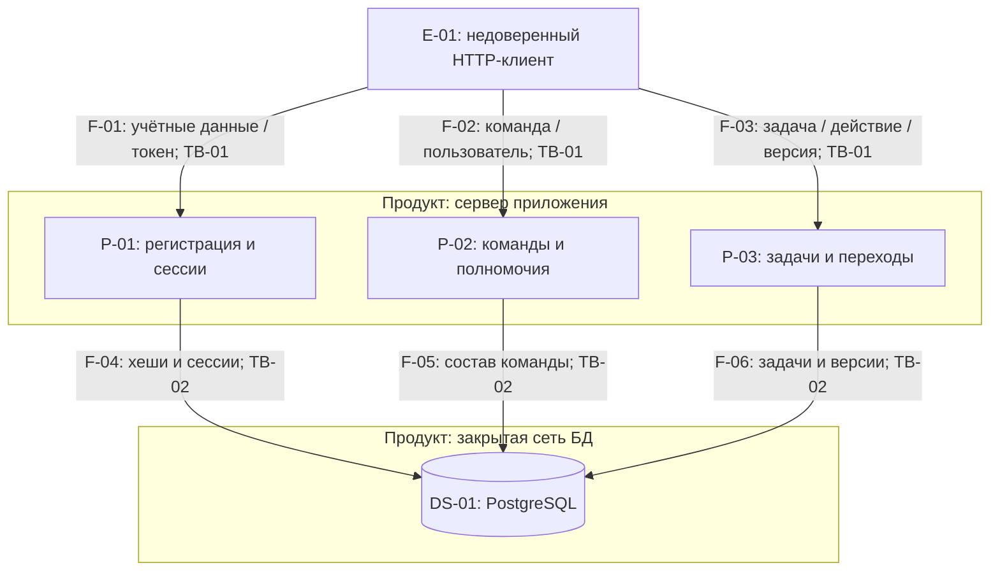

# Потоки данных и границы доверия

Схема описывает исходники этой версии и планируемую публичную границу. Техническая проверка запуска ещё требуется. Идентификаторы потоков уникальны во всём документе; старые повторяющиеся F1–F48 заменены F-01–F-06.

Обратные ответы относятся к тому же двунаправленному обмену; стрелки обозначают инициатора. Все защищённые обработчики P-02/P-03 используют проверенную сессию P-01 через authentication middleware. Логические процессы находятся в одном приложении, это не микросервисы.

| ID | Данные запроса и ответа | Проверки и значимые активы |
| --- | --- | --- |
| F-01 | Логин, пароль; bearer-токен при logout; ID пользователя или одноразово возвращаемый сырой токен | Формат, пароль, срок сессии, лимит частоты; учётная запись |
| F-02 | Bearer, ID команды/добавляемого пользователя, имя; команда и состав | Аутентификация, членство, владелец команды |
| F-03 | Bearer, ID команды/задачи, исполнитель, текст, версия; разрешённая задача или ошибка | Членство, автор/исполнитель, состояние, версия |
| F-04 | Поиск учётной записи, хеш пароля, хеш/срок сессии | Параметризованные запросы; открытый пароль и сырой токен не сохраняются |
| F-05 | Чтение/запись команды и членства | Внешние ключи, уникальная пара TeamId/UserId |
| F-06 | Чтение и запись задачи, результата, состояния, версии | Одна транзакция SaveChanges, условие UPDATE по исходной Version |

## TB-01: клиент → сервер

Клиент может подменить URL/JSON/заголовки, отправить запрос без интерфейса, повторить или распараллелить запросы. Доверять UI, идентификатору автора из JSON и одному знанию UUID нельзя. Аутентификация не заменяет проверку отношения к конкретному объекту. Для локальной демонстрации используется HTTP loopback, для внешней сети обязателен HTTPS.

## TB-02: сервер → PostgreSQL

БД — часть продукта, но отдельная граница доступа по учётным данным и сети. Порт БД не опубликован на хосте. Прямой доступ клиента отсутствует. EF Core передаёт параметры, приложение принимает решения о полномочиях. Владелец хоста и администратор БД считаются доверенными; кража их полномочий рассматривается как остаточный эксплуатационный риск.

## Граница конфигурации

Локальный .env поступает от оператора в контейнер, не от API-клиента. Это секретная конфигурация TB-03. .env не входит в Git, Docker build context и архив. Учётная запись БД в демо создаёт схему; разделение миграционной и runtime-роли отложено и явно учтено в D-03.

## Допущения

Один экземпляр API, небольшая команда, нет загрузки файлов и внешнего получения URL. Поэтому SSRF и опасная обработка вложений здесь не являются существующими поверхностями. GUI отсутствует: XSS в отображении текста станет отдельной проверкой при его добавлении; будущий клиент должен выводить текст через безопасные текстовые узлы, без innerHTML. Удаление участников и перенос задач отсутствуют; при добавлении этих операций понадобятся новые проверки отзыва доступа и конкурентности.
