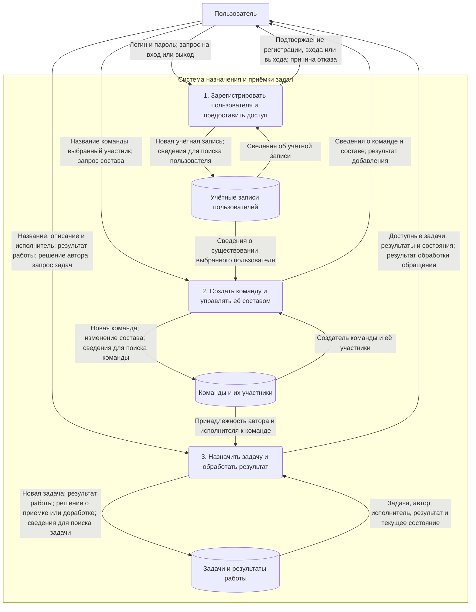
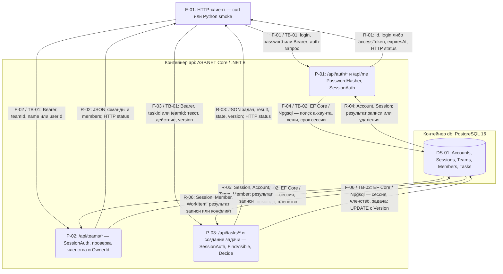

# DFD — логическая и физическая модели

Две схемы описывают один продукт — назначение задач и приёмку результатов. **Логическая модель показывает, что делает система и какими сведениями обмениваются участники. Физическая модель показывает, как эти процессы реализованы технически.**

Это диаграммы потоков данных: подпись стрелки обозначает передаваемые данные, а не порядок выполнения действий. Прямоугольники — внешние участники, скруглённые блоки — процессы, цилиндры — хранилища. У каждого направления обмена своя стрелка.

## 1. Логическая DFD

Схема предназначена для обсуждения с менеджером и пользователями. В ней нет названий языков программирования, протоколов, библиотек, таблиц базы данных и технических механизмов защиты.

«Пользователь» объединяет несколько контекстов работы одного человека. Это не означает одинаковые полномочия:

| В каком качестве действует пользователь | Какие сведения передаёт | Что получает |
| --- | --- | --- |
| Новый пользователь | Логин и пароль для регистрации | Подтверждение создания учётной записи или отказ |
| Зарегистрированный пользователь | Данные для входа или запрос выхода | Подтверждение доступа или завершения работы |
| Создатель команды | Название команды, сведения о добавляемом участнике | Созданную команду и подтверждение изменения состава |
| Участник команды | Запрос состава команды | Список её участников |
| Автор задачи | Название, описание, выбранного исполнителя; решение «принять» или «вернуть» | Созданную задачу, результат исполнителя, новое состояние |
| Исполнитель | Текст результата назначенной задачи | Подтверждение отправки и состояние задачи |
| Автор или исполнитель | Запрос доступных задач | Только связанные с ним задачи и результаты |

Процесс 3 включает создание и просмотр задачи, отправку результата, приёмку и возврат на доработку. Результат на проверке или после принятия не изменяется исполнителем. Автор и исполнитель одной задачи — разные люди. Создатель команды управляет составом, но не получает права читать все задачи команды.

Хранилища здесь — **виды сохраняемых сведений**, а не отдельные серверы или конкретные технологии. Подтверждение личности и проверка разрешённых действий выполняются внутри процессов; способ их реализации раскрыт ниже.

## 2. Физическая DFD

Схема описывает текущую реализацию: HTTP-клиент, одно приложение ASP.NET Core Web API и PostgreSQL. P-01–P-03 — группы обработчиков внутри одного приложения, не отдельные сервисы.

Упоминание SessionAuth в нескольких процессах означает **общий middleware аутентификации**, применяемый к защищённым маршрутам. Это не три разных механизма. Его чтение Sessions включено в соответствующий поток к БД. Register/login публичны; logout, /me, команды и задачи требуют действующей сессии.

### Какие данные передаются

F-01–F-06 сохранены для совместимости со ссылками в [THREATS.md](THREATS.md). R-01–R-06 явно выделяют обратные потоки. Внутри одной группы разные операции передают разные наборы полей; все перечисленные поля не требуются одновременно.

| Запрос / ответ | Интерфейс и содержимое запроса | Возвращаемые данные |
| --- | --- | --- |
| F-01 / R-01 | POST /api/auth/register и /login: JSON login, password; POST /logout и GET /api/me: Authorization: Bearer | При регистрации/чтении профиля — id, login; при входе — accessToken, tokenType, expiresAt; при выходе — 204 без тела; при отказе — код ошибки |
| F-02 / R-02 | POST /api/teams: name; GET /api/teams/{id}; POST /api/teams/{id}/members: userId. В защищённых запросах — Bearer | Созданная команда: id, name, ownerId; чтение: team и members; добавление — 204 без тела |
| F-03 / R-03 | POST /api/teams/{id}/tasks: assigneeId, title, description; GET /api/tasks и /api/tasks/{id}; POST /submit: result, version; POST /accept и /return: version. Bearer и ID в URL | Задача или список: id, teamId, authorId, assigneeId, title, description, result, state, version; при отказе — код ошибки |
| F-04 / R-04 | Параметризованные SQL через EF Core/Npgsql к Accounts и Sessions: логин для поиска, PasswordHash, TokenHash, UserId, ExpiresAt; удаление сессии при выходе | Учётная запись и хеш пароля для серверной проверки; действующая сессия; результат сохранения/удаления |
| F-05 / R-05 | Проверка Sessions; чтение Accounts для существования добавляемого пользователя; чтение/запись Teams и Members | Пользователь сессии, OwnerId, состав команды; результат изменения членства |
| F-06 / R-06 | Проверка Sessions и Members; чтение/создание Tasks; изменение Result, State, Version с условием по исходной Version | Записи задач, членство, пользователь сессии; успешная запись или отсутствие обновлённой строки при конфликте |

Сырой пароль передаётся клиентом только в register/login, а сырой токен — в ответе login и заголовке последующих запросов. **В БД сохраняются PasswordHash и TokenHash, а не исходные значения.** Чтение хеша пароля не означает его возврат клиенту.

### Техническая обработка внутри процессов

| Процесс | Технические действия |
| --- | --- |
| P-01 | PasswordHasher с солью проверяет/хеширует пароль; генерируется случайный токен из 32 байт. В Sessions сохраняется SHA-256 токена и срок 1 час. SessionAuth определяет UserId по действующей записи. Logout удаляет текущую сессию. Register/login ограничены по частоте |
| P-02 | После SessionAuth сервер проверяет членство; добавление участника разрешено только OwnerId. EF Core записывает команду и членство. Пользователь вне команды не получает её данные |
| P-03 | При создании автор берётся из сессии, исполнитель проверяется по Members. FindVisible ограничивает чтение автором/исполнителем и членством; список фильтруется теми же условиями. Submit разрешён исполнителю, Decide обрабатывает accept/return автора. Проверяются state и version; Version — concurrency token EF Core |
| Общая обработка | Kestrel ограничивает тело 64 КиБ; JSON связывается с DTO, неизвестные поля отклоняются. Ответы содержат HTTP status и при наличии тело JSON; 204 не имеет тела. Ошибки не должны раскрывать SQL, секреты или stack trace |

Проверка роли/состояния выполняется приложением. PostgreSQL обеспечивает сохранение и атомарность; результат, состояние и новая версия задачи записываются совместно. Условие UPDATE по исходной Version не даёт двум запросам успешно изменить одну версию. Конфликт обрабатывается как 409.

## 3. Соответствие моделей

| Логический процесс или хранилище | Физическая реализация |
| --- | --- |
| 1. Регистрация и предоставление доступа | P-01, обработчики auth/me, PasswordHasher и SessionAuth |
| 2. Создание команды и управление составом | P-02, обработчики teams, проверки Members и OwnerId |
| 3. Назначение задачи и обработка результата | P-03, обработчики tasks и создания задачи в команде, FindVisible/Decide |
| Учётные записи пользователей | Accounts; техническое подтверждение входа дополнительно хранится в Sessions |
| Команды и их участники | Teams, Members |
| Задачи и результаты работы | Tasks: данные задачи, Result, State, Version |

Все физические таблицы находятся в одной PostgreSQL. Логическая модель разделяет сведения по назначению, а не требует отдельной базы для каждого хранилища.

## 4. Границы доверия и развёртывание

- **TB-01 — клиент → приложение**, потоки F-01–F-03 и R-01–R-03. URL, JSON, заголовки и version недоверенные. Клиент может подменять ID и отправлять запросы напрямую. В текущем Compose используется HTTP на 127.0.0.1:8080, направленный в порт 8080 контейнера api. Для внешнего доступа требуется HTTPS; он не изображён как уже реализованный.
- **TB-02 — приложение → PostgreSQL**, потоки F-04–F-06 и R-04–R-06. EF Core/Npgsql обращается к db:5432 в сети Compose. Порт БД не опубликован на хосте; клиент не подключается к БД напрямую. Доступ определяется сетевым окружением и учётными данными БД.
- **TB-03 — оператор → конфигурация контейнеров**, отдельный поток настройки K-01, не пользовательский бизнес-процесс. Локальный .env передаёт пароль PostgreSQL через Compose в POSTGRES_PASSWORD контейнера db и ConnectionStrings__Default контейнера api. Обратного потока в клиент нет. .env исключён из Git и Docker build context. В демо учётная запись БД создаёт схему; разделение миграционной и runtime-роли отложено, см. D-03.

## 5. Границы детализации

Схемы отражают основные пользовательские потоки текущего кода. Технические GET / и /health не участвуют в назначении/приёмке: /health проверяет доступность БД и возвращает минимальный статус. Это вспомогательный диагностический обмен, не доступ к данным задач.

Графический интерфейс пока не реализован; браузерный клиент возможен в дальнейшем, но на физической схеме показаны имеющиеся HTTP-клиенты. Загрузки файлов, получения внешних URL, удаления участников и переназначения задач нет. При добавлении этих функций схемы и модель угроз должны обновляться. Диаграммы описывают устройство системы и не служат свидетельством успешного запуска или прохождения проверок.

Связанные документы: [PROJECT.md](PROJECT.md), [THREATS.md](THREATS.md), [DESIGN.md](DESIGN.md). Исходники: [Program.cs](src/TaskFlow.Api/Program.cs), [Security.cs](src/TaskFlow.Api/Security.cs), [Models.cs](src/TaskFlow.Api/Models.cs).
